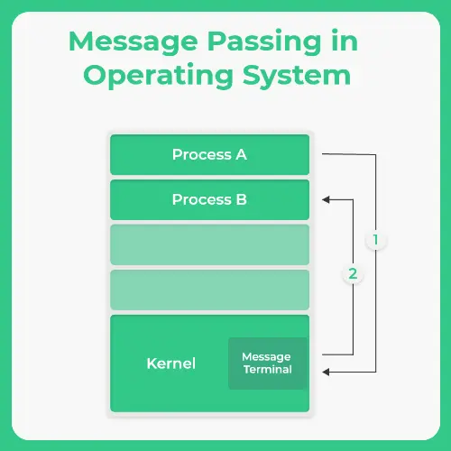
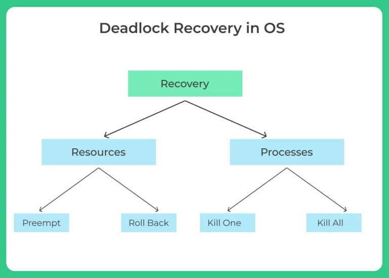

[[Introduction to OS]]
 Process synchronization is a fundamental concept in operating systems that deals with coordinating the execution of multiple processes to ensure that they operate correctly when accessing shared resources or data. It is especially important in multi processing environments, where processes might be running concurrently or in parallel.

There are two main ways processes can execute in a system:
1\. Concurrent Execution
2\. Parallel Execution

**Concurrent Execution**

* In concurrent execution, multiple processes appear to run at the same time, but in reality, the CPU executes only one instruction at a time from one process.
* The CPU scheduler rapidly switches between processes, giving the illusion of simultaneous execution. This switching is known as context switching.
* At any moment, the CPU executes a single instruction from one process and then moves to another process, interrupting the first.

**Challenges**:

* Data inconsistency due to race conditions.
* Critical section problems when multiple processes access shared memory.
* Need for proper synchronization tools like semaphores or mutexes.


Parallel Execution

* In parallel execution, two or more instructions from different processes are executed simultaneously using multiple CPU cores.
* Each core handles a separate process or thread, allowing true parallelism.
* This execution model is used in multi core processors, which are now standard in modern computing systems.

Challenges:

* Requires careful synchronization to prevent data corruption.
* Deadlocks, livelocks, and starvation need to be avoided.

### Race Condition
Process Synchronization also prevents **race around condition**. It’s the condition in which several processes access and manipulate the same data. In this condition, the outcome of the execution depends upon the particular order in which access takes place.

Critical Section:
The critical section refers to a segment of code where shared resources, like variables, files, or data structures, are accessed and modified.

If multiple processes or threads attempt to enter the critical section simultaneously, it can lead to conflicts, data inconsistency, or even system crashes.
Necessary and sufficient conditions for a solution to the critical section  problem:


- Entry Section – To enter the critical section code, a process must request permission. Entry Section code implements this request.
- Critical Section – This is the segment of code where process changes common variables, updates a table, writes to a file and so on. When 1 process is executing in its critical section, no other process is allowed to execute in its critical section.
- Exit Section – After the critical section is executed , this is followed by exit section code which marks the end of critical section code.
- Remainder Section – The remaining code of the process is known as remaining section.

Mutual Exclusion: Only a single process is allowed to enter a critical section at a time. If a process pi is executing in its critical section then no other process is allowed to enter the critical section at that time.

Progress: a process operating outside of its critical section cannot prevent other processes from entering theirs; processes attempting to enter their critical sections simultaneously must decide which process enters eventually.

## Inter Process Communication in OS

Inter Process Communication in Operating System (OS) is a fundamental concept that allows processes to exchange data and coordinate with each other. Inter process communication (IPC) is essential for enabling multiple processes to share information and synchronize their actions effectively. It plays a crucial role in resource sharing, computational speed up, and modularity in system design.


### **Independent Processes**

- Processes that do not share data with other processes.
- These processes do not share data or resources with other processes.
- They work in isolation and are not affected by the execution of other processes.
- Example: A calculator app running independently from a music player.

### **Cooperating Processes**

- Processes that shares data with other processes.
- These processes share data and resources with other processes.
- Their execution can be influenced by other processes.
- Cooperating processes are useful for:
    - Information sharing
    - Computation speed-up
    - Modularity
    - Convenience


The cooperating process requires Inter-process communication (IPC) mechanism. Inter Process Communication is the mechanism by which cooperating process share data and information.

The mechanism that will allow them to exchange data and information are the following:–

- **Shared memory**    
    - Processes communicate by accessing a shared area of memory.
    - Requires synchronization (e.g., semaphores) to avoid conflicts.
- **Message Passing**
    - Processes exchange data by sending and receiving messages.
    - More secure and easier to implement across distributed systems.

### **Shared Memory**

1. A particular region of memory is shared between cooperating process.
2. Cooperating process can exchange information by reading and writing data to this shared region.
3. It’s faster than Memory Parsing, as Kernel is required only once, that is, setting up a shared memory . After That, kernel assistance is not required.


### **Message Parsing**

1. Communication takes place by     exchanging messages directly between cooperating process.
2. Easy to implement
3. Useful for small amount of data.
4. Implemented using System Calls, so takes more time than Shared Memory.



## Critical Section

Critical Section is that section of code in each process where the process tries to access and manipulate the data that is shared among all the processes

Usually, it is ideal to allow only one process to execute the code in its  critical section because if multiple processes execute their critical sections then it may lead to undesired output in the common data that is shared which is often termed as  a "Race Condition"

Also there may be a case where a problem enters the critical section and locks the resources not letting any other process to enter critical section. This is known as  a "Deadlock".

### Necessary and sufficient conditions for a solution to the critical section  problem:

1. **Mutual Exclusion:**
2. **Progress:** 
3. **Bounded Waiting**: 
### Pseudocode of Critical Section Problem

```
while(true){
	// entry section
	process_entered=1;
	//loop until process_enetered is 0
	while(process_entered);
	// critical section
	// exit section
	process_entered=0
	// remainder section
}
```

## Mutex

- Mutex in general expands to Mutual Exclusion, which is simply a variable that is binary in nature to provide code wise functionality for mutual exclusion. 
- It synchronizes access to a shared resource.
- It makes sure that only one thread at a time can acquire mutex (think of mutex as a padlock ) and enter its critical section.

1. Mutex is Binary in nature
2. Operations like Lock and Release are possible
3. **Mutex is for Threads, while Semaphores are for processes.**
4. Mutex works in user-space and Semaphore for kernel
5. Mutex provides **locking** mechanism
6. A thread may acquire more than one mutex
7. Binary Semaphore and mutex are different

## Semaphore
Semaphore is a signalling mechanism that signal the processes about the state of the Critical Section  in OS  and grant access the  to the critical section accordingly.
**Types of Semaphores:**
 1. Binary Semaphore - Initialised to 1.
 2. Counting Semaphore - Initialised to N where N is the number of processes that can access the critical section simultaneously.
Semaphore is a non-negative value.
Semaphores use two operations, namely:
3. Wait - Decrements the value of the semaphore by 1 in the case of counting semaphore and changes to  0 in the case of binary semaphore.
4. Signal - Increments the value of the semaphore by 1 in the case of counting semaphore and changes to  1 in the case of binary semaphore.
```
signal(S)
{
    S++;
}
```

```
wait(S)
{
    while (S<=0);

   S--;
}
```


Actual Working for both functions together to achieve access of critical section –
```
   // some code
   wait(s);
   // critical section code
   signal(s);
   // remainder code
```


## **What is SpinLock ?**

While a process is in critical section, any other process which waits to enter critical section must loop continuously in call to acquire. This is a spinlock as the process “Spins” while waiting for the lock to be available.


- **Mutex has ownership; binary semaphore does not.**
- **Mutex is for locking (mutual exclusion); binary semaphore is for signaling (synchronization).**
- **Only the thread that locks a mutex can unlock it; any thread can release a binary semaphore.**
- **Mutex usually supports priority inheritance; binary semaphore typically doesn’t.**


## Atomic Operations
Atomic Operations in OS are a fundamental concept in operating systems that ensure certain operations are completed without any interruption.
These operations either complete entirely or do not happen at all, ensuring data consistency in multi threaded environments. They are essential for preventing race conditions and maintaining synchronization among concurrent processes.

### Types:
**Fine-grained atomic operations (Small Atomic Operation):**
**Coarse-grained atomic operations (Large Atomic Operations):**


## Classic Problems:
#### Reader-Writer Problem
If a reader were allowed to read while a writer is modifying the data, you could get:
- **Inconsistent reads** (e.g., reading half-updated data)
- **Race conditions**
- **Corrupted or meaningless results**
#### Dining Philosopher Problem:
It helps understand how we can simultaneously utilise common resources of multiple processes together.

### Sleeping Barber
### Producer - Consumer
### Peterson's algorithm

# Deadlock

1. Mutual exclusion: Resources are held in a non-shareable mode, meaning that only one process can use a resource at a time.
    
2. Hold and wait: A process is holding at least one resource and waiting for additional resources that are currently being held by other processes.
    
3. No preemption: Resources cannot be taken away from a process once they have been acquired.
    
4. Circular wait: Two or more processes are waiting for each other to release resources, resulting in a cycle of waiting.
    
5. Deadlock can occur in a variety of computing environments, including distributed systems, databases, and operating systems.
    
6. Deadlock can be resolved through various methods such as prevention, detection, and recovery.
### Deadlock Recovery

Once a deadlock has been detected, it must be resolved. There are several methods for deadlock recovery, including:

- Killing one or more processes: This is known as the “abort” method, where the operating system kills one or more of the processes involved in the deadlock in order to release the resources and resolve the deadlock.
- Resource preemption: This method involves forcibly taking resources from a process and giving them to another process in order to resolve the deadlock.
- Resource allocation: This method involves changing the way resources are allocated in order to prevent deadlocks from occurring in the future.

It’s worth noting that, besides the above mentioned methods, there’s another one called “Rollback” which involves rolling back one or more processes to a previous state in order to release resources and resolve the deadlock.



**Some common methods of deadlock prevention include:**

1. **Resource allocation:** By allocating resources in a way that ensures that a process can never enter a deadlock state, such as using the Banker’s Algorithm, which checks for safe states before allocating resources.
    
2. **Limit on resources:** By limiting the number of resources a process can request, a deadlock state can be prevented from occurring.
    
3. **Timeout:** By setting a timeout for resource requests, a process will release a resource if it is unable to acquire it within a certain time period.
    
4. **Priority-based resource allocation:** By allocating resources based on the priority of the process, a deadlock state can be prevented from occurring.
    
5. **Preemptive resource allocation:** By preempting resources from a process that has been holding them for a long time, a deadlock state can be prevented from occurring.

## Deadlock avoidance in OS

Deadlock avoidance is a technique used in operating systems to prevent the situation where two or more processes are unable to proceed because each is waiting for one of the others to release a resource. Unlike deadlock prevention, which uses static information to prevent a deadlock from occurring, deadlock avoidance uses dynamic information, such as the current state of the system and the resource allocation, to ensure that a deadlock never occurs. Some common methods of deadlock avoidance include:

1. **Wait/Die:** In this method, a process that requests a resource that is not available will wait until the resource becomes available. If a process that holds the resource is also requesting a resource that is not available, the process that has been waiting the longest will be allowed to proceed.
    
2. **Wound/Wait:** In this method, a process that requests a resource that is not available will be killed (wounded) if a process that holds the resource is also requesting a resource that is not available. The process that was killed will have to request the resource again later.
    
3. **Resource allocation graph:** By representing the resources and the processes as nodes in a graph, the operating system can use algorithms to check for safe states before allocating resources.
    
4. **Banker’s Algorithm:** This algorithm is a variant of Resource Allocation Graph algorithm, it uses the available and maximum resource information for each process, the algorithm checks for safe state before allocating resources.
    
5. **Time-stamp ordering:** In this method, a process is only allowed to request a resource if its time stamp is greater than the time stamp of the process that holds the resource.