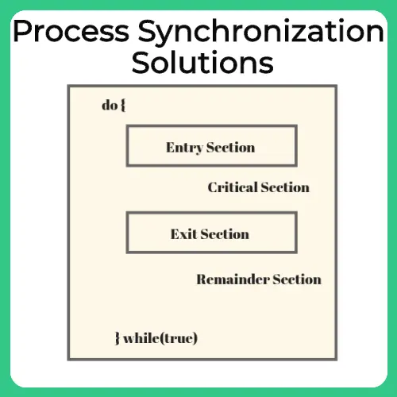
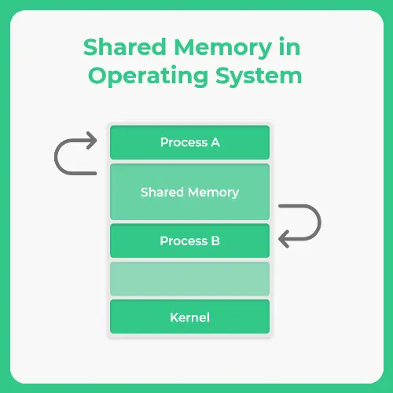

[[Introduction to OS]]
 Process synchronization is a fundamental concept in operating systems that deals with coordinating the execution of multiple processes to ensure that they operate correctly when accessing shared resources or data. It is especially important in multi processing environments, where processes might be running concurrently or in parallel.

There are two main ways processes can execute in a system:
1\. Concurrent Execution
2\. Parallel Execution

**Concurrent Execution**

* In concurrent execution, multiple processes appear to run at the same time, but in reality, the CPU executes only one instruction at a time from one process.
* The CPU scheduler rapidly switches between processes, giving the illusion of simultaneous execution. This switching is known as context switching.
* At any moment, the CPU executes a single instruction from one process and then moves to another process, interrupting the first.

**Challenges**:

* Data inconsistency due to race conditions.
* Critical section problems when multiple processes access shared memory.
* Need for proper synchronization tools like semaphores or mutexes.

Parallel Execution

* In parallel execution, two or more instructions from different processes are executed simultaneously using multiple CPU cores.
* Each core handles a separate process or thread, allowing true parallelism.
* This execution model is used in multi core processors, which are now standard in modern computing systems.

Challenges:

* Requires careful synchronization to prevent data corruption.
* Deadlocks, livelocks, and starvation need to be avoided.

### Race Condition
Process Synchronization also prevents **race around condition**. It’s the condition in which several processes access and manipulate the same data. In this condition, the outcome of the execution depends upon the particular order in which access takes place.

Critical Section:
The critical section refers to a segment of code where shared resources, like variables, files, or data structures, are accessed and modified.

If multiple processes or threads attempt to enter the critical section simultaneously, it can lead to conflicts, data inconsistency, or even system crashes.
Necessary and sufficient conditions for a solution to the critical section  problem:

- Entry Section – To enter the critical section code, a process must request permission. Entry Section code implements this request.
- Critical Section – This is the segment of code where process changes common variables, updates a table, writes to a file and so on. When 1 process is executing in its critical section, no other process is allowed to execute in its critical section.
- Exit Section – After the critical section is executed , this is followed by exit section code which marks the end of critical section code.
- Remainder Section – The remaining code of the process is known as remaining section.

Mutual Exclusion: Only a single process is allowed to enter a critical section at a time. If a process pi is executing in its critical section then no other process is allowed to enter the critical section at that time.

Progress: a process operating outside of its critical section cannot prevent other processes from entering theirs; processes attempting to enter their critical sections simultaneously must decide which process enters eventually.

## Inter Process Communication in OS

Inter Process Communication in Operating System (OS) is a fundamental concept that allows processes to exchange data and coordinate with each other. Inter process communication (IPC) is essential for enabling multiple processes to share information and synchronize their actions effectively. It plays a crucial role in resource sharing, computational speed up, and modularity in system design.

### **Independent Processes **

- Processes that do not share data with other processes.
- These processes do not share data or resources with other processes.
- They work in isolation and are not affected by the execution of other processes.
- Example: A calculator app running independently from a music player.

### **Cooperating Processes **

- Processes that shares data with other processes.
- These processes share data and resources with other processes.
- Their execution can be influenced by other processes.
- Cooperating processes are useful for:
    - Information sharing
    - Computation speed-up
    - Modularity
    - Convenience

The cooperating process requires Inter-process communication (IPC) mechanism. Inter Process Communication is the mechanism by which cooperating process share data and information.

The mechanism that will allow them to exchange data and information are the following:–

- **Shared memory**    
    - Processes communicate by accessing a shared area of memory.
    - Requires synchronization (e.g., semaphores) to avoid conflicts.
- **Message Passing**
    - Processes exchange data by sending and receiving messages.
    - More secure and easier to implement across distributed systems.

### **Shared Memory**

1. A particular region of memory is shared between cooperating process.
2. Cooperating process can exchange information by reading and writing data to this shared region.
3. It’s faster than Memory Parsing, as Kernel is required only once, that is, setting up a shared memory . After That, kernel assistance is not required.
