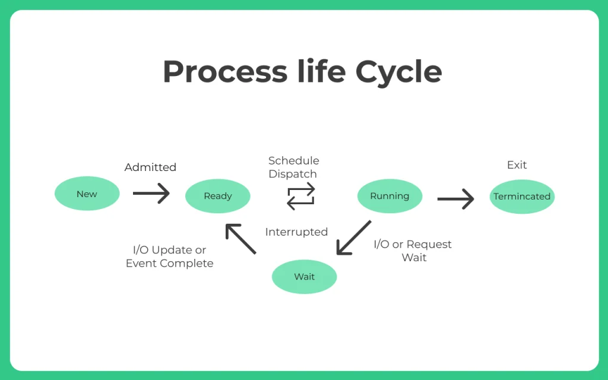
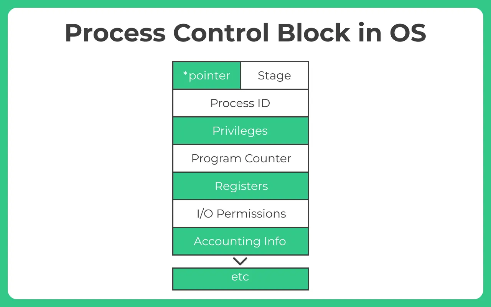
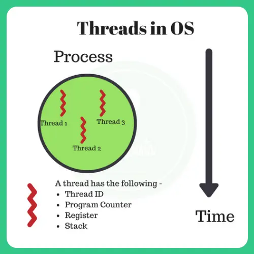

[[Introduction to OS]]
A Program in execution is called a process. 
- How is a process different from a program?
A program is just a set of instructions saved in a file. A process is what that program becomes when it starts running. So, a process is an active version of a program.
- What is the difference between a process and a thread?
A process is a complete program with its own memory. A thread is a smaller part of a process that shares the same memory. Threads help a process do multiple things at the same time, like loading a video while showing the controls.
## Process Scheduling 
Vital aspect in operating system design. 
Decides the order in which the processes are executed by the processor
Various algorithms are used to allocate CPU resources to processes efficiently. These algorithms aim to **optimize resource utilization and minimize process waiting time**
The most common ones are:
- **Fist In First Out / First Come First Served**
- **Shortest Job First**
 - **Priority Scheduling  (Greater number have higher priority unless/until it is explicitly mentioned)**
 - **Round Robin**

### **Process Life Cycle**

**Process life cycle consists of the following stages –**

1. **New –** Whenever, a fresh process is created it gets available in the new state, it can collect relevant resources like data, I/O access etc... in the mean time
2. **Ready –** It gets assigned to ready stage where it waits to be assigned to a processor. This is a sort of a queue for all processes which are waiting for processor, such queue is called the **Ready Queue**.
3. **Running –** The process is being executed by processor it gets into running stage.
4. **Waiting –** Sometimes, cases happen when a process has to accept an additional input from user or maybe a higher priority process needs processor, in such cases the process goes to wait stage or waiting queue where all the processes are waiting for processor and complete their execution.- A resource or memory access that maybe locked by another process, so current process goes to **waiting state and waits** for the resource to get free.
5. **Terminated –** When process has completed executing its all instructions or when it’s ended by the user directly it goes to terminated stage.

Apart from this new age system also classify –

1. **Suspended Ready –** If ready queue is full and has no space for new process then entry level process is in suspended Ready State
2. **Suspended Block –** If the waiting queue is full

### **Process Elements**

Every process has a process memory, which is generally divided into 4, this is done to make the most efficient functioning as possible –

1. **Stack –** This houses all the temporary data and local variables like function parameters and addresses.
2. **Heap –** When the process is in its run time, for dynamic memory allocation, for operations such as new(), delete(), malloc(), etc... heap is used for fastest access at the run time.
3. **Text –** Contains value of Program Counter and the contents of the processor’s registers which are just the most low level instructions of the compiled program
4. **Data –** Has static and global variables.

## Process Creation
How is a process actually created?
It is done in various ways such as when a user initiates a program (opens an app) or when the OS launches system processes during startup
Process Creation involves allocating necessary resources, setting up execution environment, initializing the PCB (Process Control Block)

## Process Control Block (PCB):

Process Control Block in Operating System is a data structure which has all the information that is needed by a scheduler to schedule a particular process, this data structure rests in the operating system Kernel.

When we use a computer or a mobile phone, we often open multiple apps or perform many tasks at once – like listening to music while browsing the internet or downloading a file.  The system keeps track of all these running tasks without getting confused using PCB
**Without PCBs, the system wouldn’t know what each task was doing – leading to confusion and errors.**

1. **Process ID or PID –** Unique Integer Id for each process in any stage of execution.
2. **Process Stage –** The state any process currently is in, like Ready, wait, exit etc
3. **Process Privileges –** The special access to different resources to the memory or devices the process has.
4. **Pointer** – Pointer location to the parent process.
5. **Program Counter –** It will always have the address of the next instruction in line of the processes
6. **CPU Registers –** Before the execution of the program the CPU registered where the process needs to be stored at.
7. **Scheduling Information –** There are different scheduling algorithms for a process based on which they will be selected in priority. This section contains all the information about the scheduling.
8. **Memory Management Information –** The operating system will use a lot of memory and it needs to know information like – page table, memory limits, Segment table to execute different programs MIM has all the information about this.
9. **Accounting Information –** As the name suggest it will contain all the information about the time process took, Execution ID, Limits etc.
10. **I/O Status** – The list of all the information of I/O the process can use.

The PCB architecture is completely different for different OSes. The above is the most generalised architecture.

### Context Switching:
When the CPU switches from one process to another (called context switching), the current process’s PCB is updated with its last state. Then, the OS loads the next process’s PCB to start/resume that task.

This mechanism is what allows multitasking in modern operating systems.  

### Process Scheduling:
Process Scheduling is the way your computer decides which task (or process) should run first, and which one can wait.
Since your system can’t run all programs at the exact same time, it quickly switches between them — giving each a fair share of the processor’s time.
This helps all your apps work properly and smoothly, without delay or lag.
Focus for Intelligent Scheduling is to
Keep CPU busy as much as possible if processes are waiting for execution
Decrease the time of execution of critical processes
Intelligently prioritize processes for execution
Keep the response time minimum.

There are three type of schedulers categorically –
- Long-term Scheduler
- Short-term Scheduler
- Medium-term Scheduler
#### Long Term Scheduler
Also known as Job Scheduler. It selects the process that are to be placed in ready queue. The long term scheduler basically decides the priority in which processes must be placed in main memory. Processes of long term scheduler are placed in the ready state because in this state the process is ready to execute waiting for calls of execution from CPU which takes time that’s why this is known as long term scheduler.
#### Medium-Term Scheduler
It places the blocked and suspended processes in the secondary memory of a computer system. The task of moving from main memory to secondary memory is called swapping out. The task of moving back a swapped out process from secondary memory to main memory is known as swapping in. The swapping of processes is performed to ensure the best utilization of main memory...
#### Short-Term Scheduler
Also knowns as CPU Scheduler. It decides the priority in which processes is in the ready queue are allocated the central processing unit (CPU) time for their execution. The short term scheduler is also referred as central processing unit (CPU) scheduler.

How Context Switching Works: Step-by-Step
Let’s break it down into a sequence of steps:

**Interrupt Occurs:** The currently running process is interrupted. This could be due to a timer interrupt, I/O request, or a higher-priority task needing CPU time.
**Save Current Process State:** The CPU saves the current state (registers, program counter, stack pointer, etc.) of the running process in its PCB (Process Control Block).
**Update PCB:** The OS updates the PCB with the saved values to preserve the context.
**Choose Next Process:** The scheduler selects the next process from the ready queue based on a scheduling algorithm like Round Robin, Priority Scheduling, etc.
**Load New Process Context:** The CPU loads the context of the new process from its PCB.
**Transfer Control:** The CPU starts executing the new process from where it left off.

This entire cycle happens so fast (in microseconds) that users don’t even notice it.

### Advantages of Context Switching:
- **Multitasking Support**  
- **Better CPU Utilization**  
- **Fair Resource Distribution**  
- **Improved System Responsiveness**  

## CPU Scheduling

- **CPU Burst Time –** In simple terms, the duration for which a process gets control of the CPU is the CPU burst time, and the concept of gaining control of the CPU is the CPU burst. Similarly, an I/O burst is the concept of performing I/O operations.
-  **Waiting Time** is the total amount of time spent in the ready queue to gain the access of the CPU for execution.
- **Turn Around Time –** From the time the process is submitted to the time the process is completed, is defined as Turn Around Time.
- **Throughput –** In a unit time the number of processes that can be completed is called the throughput.
#### Non Preemptive Scheduling
In this type of scheduling, if a process enters the CPU and gets processing time, the process will keep on executing until it has terminated or has to forcibly go to waiting state as it needs a resource that it locked by another parallel process.

Example – SJF i.e. Shortest Job First (Non Preemptive)
#### Preemptive Scheduling
In this type of scheduling, if a process enters the CPU and gets processing time. It can get switched by another process that have higher priority.
Priority may be fixed i.e. may be assigned to each process or **time based dynamic priority** as in the case of SRTF algorithm. 

Example – SRTF i.e. Shortest Remaining time First (Also known as SJF – Preemptive)

## Advantages of FCFS Algorithm
- **Non-preemptive Scheduling:** Once a process starts executing, it will not be interrupted until completion.
- **First Come, First Served:** The process that arrives first will be executed first, similar to a queue in real life.
- **Fairness:** FCFS is fair in terms of the order of execution; each process is executed in the order it arrives.
- **Burst Time:** The total time a process needs to complete its execution. It is a key factor in determining the total time a process will spend in the system.
### Disadvantages of FCFS Algorithm

- Since, its a non preemptive algorithm thus, there is no intelligence applied and no priority can be given to processes.
- If critical system process arrives it may have to wait for a process like calculator.
- Waiting time may get too high, along with the turn around time.
- Causes convoy effect

### **What is convoy effect?**

FCFS may suffer from the **convoy effect** if the burst time of the first job is the highest among all. As in the real life, if a convoy is passing through the road then the other persons may get blocked until it passes completely. This can be simulated in the Operating System also.

If the CPU gets the processes of the higher burst time at the front end of the ready queue then the processes of lower burst time may get blocked which means they may never get the CPU if the job in the execution has a very high burst time. This is called **convoy effect**.
### **Starvation**
Starvation is the process in which a process with higher burst time is kept on waiting and waiting , but is not allocated to the CPU. It’s prevented by **aging.**
#### Aging
It works by gradually increasing the priority of long-waiting processes, ensuring that a process will eventually become a high-priority task and get its turn for execution.

### SJF
**Shortest Job First Scheduling (Non Preemptive Algorithm) in Operating System**

- Shortest Job First  (SJF) is a Scheduling Algorithm where the process are executed  in ascending order of their burst time, that is, the process having the shortest burst time is executed first and so on.
- **The processor knows burst time of each process in advance.**
- It can be thought of as shortest-next-cpu-burst algorithm, as Scheduling depends on length of the next CPU burst of a process. ( The duration for which a process gets control of the CPU, is the Burst time for a process.)
- SJF can be Pre-emptive or Non- preemptive. Under Non-preemptive Scheduling , once a process has been allocated to CPU, the process keeps the CPU until the process has finished its execution.

## Features of SJF

- SJF is a greedy Algorithm
- It has Minimum average waiting time among all scheduling algorithms.
- Difficulty of SJF is knowing the length of next CPU request.
- It’s used frequently in Long-term scheduling in Batch System as in this, the time limit is provided by the user specifying the process. We presume that user provides accurate time limit as lower accurate value means faster response.
- SJF can’t be implemented in Short-term scheduling as one can’t know the exact length of next CPU burst. It can be Approximated by doing an exponential average of already measured length of previous CPU burst.
## Round Robin Scheduling Algorithm

In Round robin Scheduling Algorithm, each process is given a fixed time called quantum for execution. After the Quantum of time passes, the current running process is preempted and the next process gets executed for next quantum of time

#### **Difference between Scheduler and Dispatcher**

| Feature      | Scheduler                                           | Dispatcher                                                |
| ------------ | --------------------------------------------------- | --------------------------------------------------------- |
| Function     | Selects which process to run next                   | Gives control of the CPU to the selected process          |
| Role         | Decision-maker for process selection                | Executor of that decision                                 |
| Timing       | Runs before the process is chosen                   | Runs after the scheduler chooses a process                |
| Involves     | Algorithm-based selection (e.g., FCFS, Round Robin) | Context switching, mode switching, jumping to user code   |
| Speed Impact | Affects overall system scheduling efficiency        | Affects the speed of context switching (dispatch latency) |

**Both the scheduler and dispatcher are vital components of an operating system’s process management. The scheduler is responsible for selecting which process should run next, using various scheduling algorithms. On the other hand, the dispatcher executes this decision by performing tasks like context switching and transferring control to the selected process. While the scheduler focuses on decision-making, the dispatcher ensures smooth execution. Together, they manage CPU utilization efficiently and enable multitasking. Understanding their roles helps in grasping the inner workings of modern operating systems.**

### Pre-emptive vs Non Pre-emptive
| Feature                   | Preemptive Scheduling                                     | Non-Preemptive Scheduling                                         |
| ------------------------- | --------------------------------------------------------- | ----------------------------------------------------------------- |
| CPU Control               | CPU can be taken away from a running process              | CPU is not taken away until the process finishes or waits         |
| Interruption              | Process can be interrupted at any time                    | Process runs to completion without interruption                   |
| Process Priority Handling | Higher priority processes can preempt lower priority ones | Higher priority processes must wait until the CPU is free         |
| Context Switching         | More frequent due to interruptions                        | Less frequent, only when a process finishes or waits              |
| Responsiveness            | More responsive to real-time or urgent tasks              | Less responsive; can cause delays for short processes             |
| Overhead                  | Higher overhead due to frequent context switching         | Lower overhead                                                    |
| Complexity                | More complex to implement                                 | Simpler to implement                                              |
| Fairness                  | More fair processes are time-shared                       | Can lead to longer wait times for short or low priority processes |

### **What is Multi-Level Queue (MLQ) Scheduling?**

MLQ scheduling **divides ready processes into multiple separate queues**, where each queue has its **own scheduling policy**. Processes are permanently assigned to a queue based on specific characteristics (e.g., foreground/background, system/user process, priority level).

Each queue can have its own algorithm, such as:

- Round Robin (RR)
- First-Come, First-Served (FCFS)
- Priority scheduling
    

The OS then schedules queues themselves in a **fixed priority order**.

---

###  **Key Features**

- **Multiple queues** with different priority levels
- **No movement** of processes between queues (in strict MLQ)
- **Each queue has its own scheduling algorithm**
- **Upper-priority queues always run first**, lower queues run only when upper queues are empty
    
###  Example

Suppose we have 3 queues:

1. **System processes** → Highest priority, FCFS
2. **Interactive/Foreground** → Round Robin
3. **Background/Batch** → Lowest priority, FCFS

The CPU always schedules queue 1 first. If it's empty, it moves to queue 2, and so on.

## **Multi-Level Feedback Queue (MLFQ) Scheduling**

###  How it works:

- Like MLQ, has multiple queues
- **Processes CAN move between queues** (feedback mechanism)
- Short jobs stay in higher-priority queues
- Long CPU-bound jobs get pushed to lower queues
- Supports **aging** to prevent starvation
    

### Goal:
Optimize the system for both interactive and background workloads.

###  Queue behavior:

- If a process uses too much CPU → **demoted to lower queue**
- If it waits too long → **promoted back up**

## Threads:
. Threads are **Smallest sequence of programmed instruction** that can be managed independently by a scheduler.
- A thread comprises of its own
    - **Thread ID –** Unique ID for a thread in execution
    - **Program counter –** Keeps track of instruction to execute
    - **System Register set –** Active Variables of thread
    - **Stack –** All execution history (Can be used for debugging)
    

### **What is a program?**

Program is an executable file containing the set of instructions written to perform a specific job on your computer. For example, **notepad.exe** is an executable file containing the set of instructions which help us to edit and print the text files.

Programs are not stored on the primary memory in your computer. They are stored on a disk or a secondary memory on your computer. They are read into the primary memory and executed by the kernel. A program is sometimes referred as **passive entity** as it resides on a secondary memory.

### **What is a process?**

Process is an executing instance of a program. For example, when you double click on a notepad icon on your computer, a process is started that will run the notepad program.

A process is sometimes referred as **active entity** as it resides on the primary memory and leaves the memory if the system is rebooted. Several processes may related to same program. For example, you can run multiple instances of a notepad program. Each instance is referred as a process.

### **What is a thread?**

Thread is the smallest executable unit of a process. For example, when you run a notepad program, operating system creates a process and starts the execution of main thread of that process.

A process can have multiple threads. Each thread will have their own task and own path of execution in a process. For example, in a notepad program, one thread will be taking user inputs and another thread will be printing a document.

All threads of the same process share memory of that process. As threads of the same process share the same memory, communication between the threads is fast.